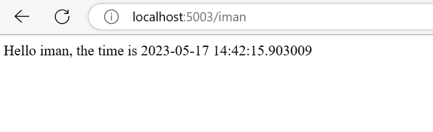

# Demo 03
## Description
This demo is a simple web application that uses Flask to display a web page with a greeting, the current time, and the name of the host(user). The application is composed of three files.
## Requirement
- Python 3, tested with Python 3.10.6 on ubuntu 22.04, please consult [this link](https://www.python.org/downloads/) for other OS.
## Run.
- install virtualenv `sudo  apt install python3.10-venv` (only need once, don't need to repeat if you already have virtualenv, you may change python3.10-venv to any other version of python3-venv that match your python version)  
- create virtualenv `python -m venv .venv`
- activate virtualenv `source .venv/bin/activate`
- install requirements `pip install -r requirements.txt`
- run 4 terminals, one for each application
    - `python hello.py`
    - `python world.py`
    - `python time.py`
    - `python hello-world.py`  
 
- access from browser  

- deactivate virtualenv `deactivate`
