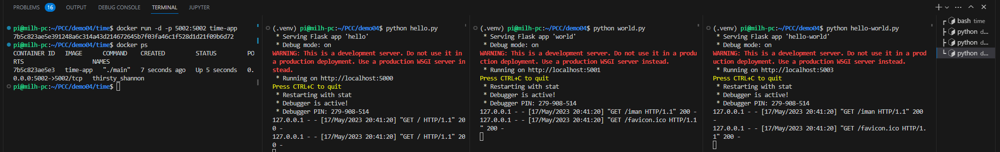
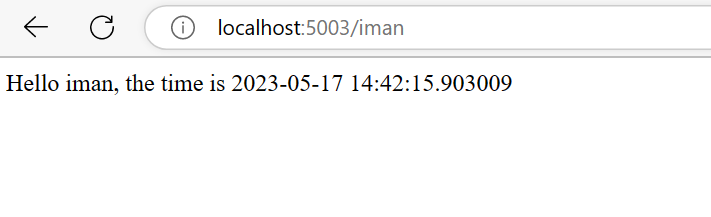

# Demo 04
## Description
This demo is a simple web application that uses Flask to display a web page with a greeting, the current time, and the name of the host(user). The application is composed of three files.
in this version time app is written in golang, so we will use docker to run it.
## Requirement
- Python 3, tested with Python 3.10.6 on ubuntu 22.04, please consult [this link](https://www.python.org/downloads/) for other OS.
## Run.
- install virtualenv `sudo  apt install python3.10-venv` (only need once, don't need to repeat if you already have virtualenv, you may change python3.10-venv to any other version of python3-venv that match your python version)  
- create virtualenv `python -m venv .venv`
- activate virtualenv `source .venv/bin/activate`
- install requirements `pip install -r requirements.txt`
- run 4 terminals, one for each application
    - `python hello.py`
    - `python world.py`
    - `python hello-world.py`  
- for time app, it's golang app, we will use docker (see docker documentation at https://docs.docker.com/get-started/overview/ for more detail)
```dockerfile
# Start from the latest golang base image
FROM golang:1.20

# Add Maintainer Info
LABEL maintainer="iman <iman4hakim@gmail.com>"

# Set the Current Working Directory inside the container
WORKDIR /app

# Copy go mod and sum files
COPY go.mod go.sum ./

# Download all dependencies. Dependencies will be cached if the go.mod and go.sum files are not changed
RUN go mod download

# Copy the source from the current directory to the Working Directory inside the container
COPY . .

# Build the Go app
RUN go build -o main .

# Expose port 5002 to the outside
EXPOSE 5002

# Command to run the executable
CMD ["./main"]

```
You can build the Docker image by running the following command in the directory containing the Dockerfile:

```bash
docker build -t time-app .
```
This command builds a Docker image and tags it as `time-app`.
You can run the Docker container using the following command:

```bash
docker run -d -p 5002:5002 time-app
```
if you want to see status of your docker container, you can use this command:
```bash
docker ps
```
you will see something like this:
```bash
CONTAINER ID   IMAGE      COMMAND       CREATED          STATUS          PORTS                                       NAMES
e1b2b2b2b2b2   time-app   "./main"      2 minutes ago    Up 2 minutes
```
to stop the container, you can use this command:
```bash
docker stop e1b2b2b2b2b2
```

- access from browser  
