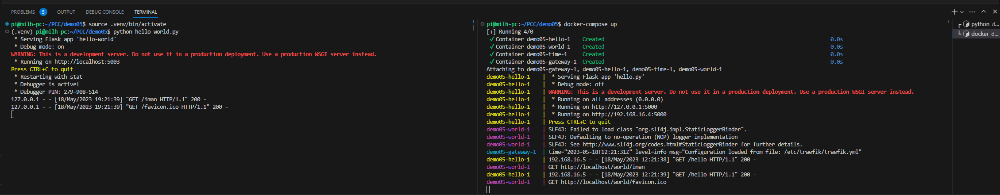
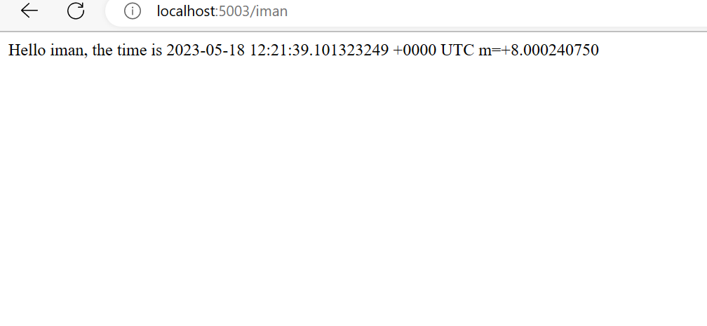

# Demo 06
## Description
see Demo05, this one only add middleware for authentication

## Requirement
- Docker and Docker Compose, tested with Docker version 20.10.8, build 3967b7d and docker-compose version 1.29.2
- Images for each application, see Dockerfile in each application folder for more detail.
- need htpasswd to generate password, on ubuntu can be installed using command `sudo apt install apache2-utils`   
  generated static password using command example 
  ```bash
  $ htpasswd -nb admin pass
    admin:$apr1$6KXq/9Ap$lSVXah1Uas0/O0fn2xkyM1
  ```

## Run.
- before run this demo, make sure you have docker and docker-compose installed in your machine.
- create network called `web` for traefik reverse proxy to communicate with other application
```bash
docker network create web
```
- run all application using docker-compose
```bash
docker-compose up -d
```

- open browser and go to http://localhost/hello or http://localhost/world or http://localhost/time for each application (service) directly,
- run hello-world.py `python hello-world.py` (see previous demo for more detail)
```python
def hello_world(name):
    hello = requests.get('http://localhost/hello').text
    world = requests.get(f'http://localhost/world/{name}').text
    time = requests.get('http://localhost/time').text
    return f"{hello} {world}, the time is {time}"
```
- go to http://localhost:5003/iman to access combined service trought hello-world.py  


- you may also access html client version by go to http://localhost 
Here is the javascript client code, with basic authentication
```javascript
<script>
    async function fetchGreeting(name = 'world') {
        const username = 'admin';
        const password = '$apr1$6KXq/9Ap$lSVXah1Uas0/O0fn2xkyM1';
        const headers = new Headers();
        headers.set('Authorization', 'Basic ' + btoa(username + ":" + password));
        
        try {
            const hello = await fetch('http://localhost/hello', { headers: headers }).then(res => res.text());
            const world = await fetch(`http://localhost/world/${name}`, { headers: headers }).then(res => res.text());
            const time = await fetch('http://localhost/time', { headers: headers }).then(res => res.text());

            document.getElementById('greeting').innerText = `${hello} ${world}, the time is ${time}`;
        } catch (error) {
            console.error('Error:', error);
        }
    }

    window.onload = function() {
        fetchGreeting();
    }
    </script>
```
- to stop all application
```bash
docker-compose down
```
- to stop all application and remove all container
```bash
docker-compose down --rmi all
```
- to stop all application and remove all container and volume
```bash
docker-compose down --rmi all --volumes
```
- to stop all application and remove all container and volume and network
```bash
docker-compose down --rmi all --volumes --remove-orphans
```
- to follow log of all application
```bash
docker-compose logs -f
```
- to follow log of specific application
```bash
docker-compose logs -f <application_name>
```
- to access shell of specific application
```bash
docker-compose exec <application_name> sh
```
- to see status of all application
```bash
docker-compose ps
```
- to see status of specific application
```bash
docker-compose ps <application_name>
```

Complete docker-compose command can be found [here](https://docs.docker.com/compose/reference/overview/)

here ini docker-compose.yml file
```yaml
version: '3'

services:
  gateway:
    image: traefik:v2.5
    command: --configFile=/etc/traefik/traefik.yml
    volumes:
      - ./traefik.yml:/etc/traefik/traefik.yml
      - ./traefik-dynamic-conf.yml:/etc/traefik/traefik-dynamic-conf.yml
      - /var/run/docker.sock:/var/run/docker.sock
    ports:
      - "80:80"
      - "443:443"
      - "8080:8080"
    networks:
      - web

  hello:
    build: 
      context: hello
      dockerfile: Dockerfile
    # ports:
    #   - "5000:5000"
    networks:
      - web
  world:
    build: 
      context: world
      dockerfile: Dockerfile
    # ports:
    #   - "5001:5001"
    networks:
      - web
  time:
    build: 
      context: time
      dockerfile: Dockerfile
    # ports:
    #   - "5002:5002"
    networks:
      - web
  client:
    build: 
      context: client
      dockerfile: Dockerfile
    # ports:
    #   - "5003:5003"
    networks:
      - web

networks:
  web:
    external: true
```

Traefik configuration file to route all applications, route support regex, so we can use regex to route all application with one rule. if you not familiar with regex, you can use [regex101](https://regex101.com/) to test your regex. or regex cheat sheet [here](https://cheatography.com/davechild/cheat-sheets/regular-expressions/), my favorite regex tool is regexbuddy, but it's not free, it's offline tool, you can download it [here](https://www.regexbuddy.com/), this tools based on popular regex book [Mastering Regular Expressions](https://www.amazon.com/Mastering-Regular-Expressions-Jeffrey-Friedl/dp/0596528124)
```yaml
# Dynamic configuration
http:
  routers:
    router01:
      entryPoints:
        - web
      middlewares:
        - basic-auth
      service: hello
      rule: Path(`/hello`)
    router02:
      entryPoints:
        - web
      middlewares:
        - basic-auth
      service: world
      rule: PathPrefix(`/world{part:[\/]*?}`,`/world/{name:[0-9A-Za-z]*}`)
    router03:
      entryPoints:
        - web
      middlewares:
        - basic-auth
      service: time
      rule: Path(`/time`)
    router04:
      entryPoints:
        - web
      service: client
      rule: Path(`/`)
  
  services:
    hello:
      loadBalancer:
        servers:
          - url: http://hello:5000/
    world:
      loadBalancer:
        servers:
          - url: http://world:5001/
    time:
      loadBalancer:
        servers:
          - url: http://time:5002/
    client:
      loadBalancer:
        servers:
          - url: http://client:5003/
  
  middlewares:
    basic-auth:
      basicAuth:
        users:
          - "admin:$apr1$6KXq/9Ap$lSVXah1Uas0/O0fn2xkyM1"
```